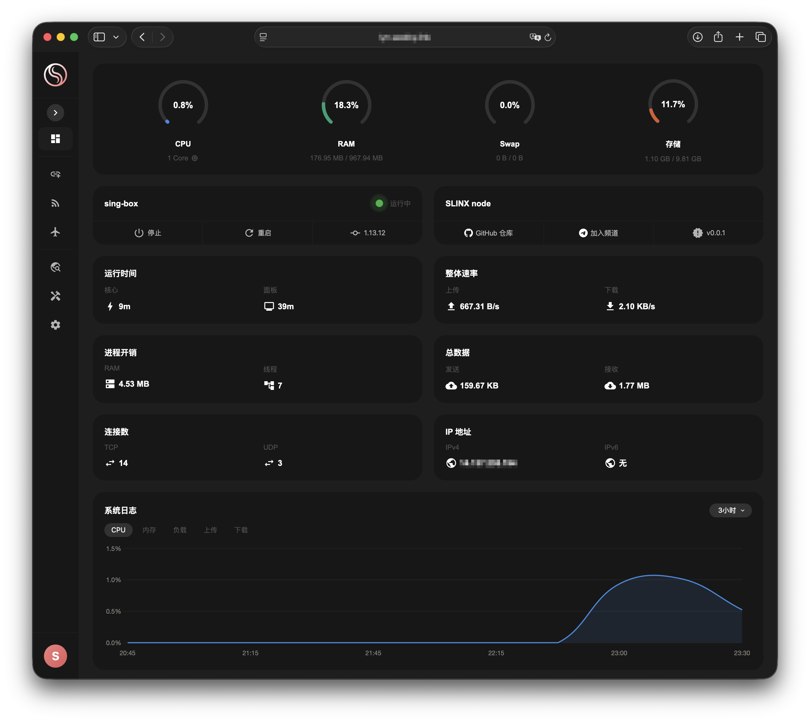
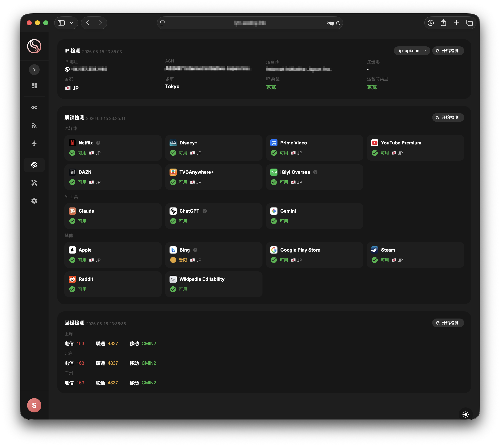
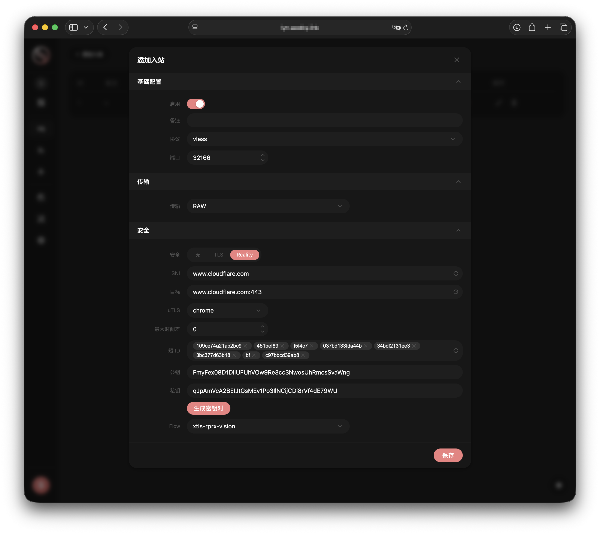

<div align="center">
  
  <h1>SLINX node</h1>
  <p>基于 sing-box 核心的节点管理面板</p>

  [](https://github.com/slinxlink/node/releases)
  [](https://github.com/slinxlink/node)
  [](https://github.com/slinxlink/node/releases/latest)
  [](LICENSE)
  [](https://pkg.go.dev/github.com/slinxlink/node)
  [](https://goreportcard.com/report/github.com/slinxlink/node)
</div>

> [!IMPORTANT]
> 本项目仅供个人使用。请勿将其用于非法目的，也请勿在生产环境中使用。

## 安装

```bash
bash <(curl -sL https://raw.githubusercontent.com/slinxlink/node/main/install.sh)
```

安装完成后使用 `slinx` 命令管理面板。

## 简介

SLINX node 是一个基于 sing-box 核心的节点管理面板，提供完善的证书管理、机场面板对接、一键节点生成，支持通用、Clash 等多种订阅格式。

## 功能

- 🚀 基于 sing-box 核心，支持 VLESS、VMess、Hysteria2 等协议
- 📜 证书管理，支持 Let's Encrypt、ZeroSSL，DNS/HTTP 验证
- 🔗 机场面板对接（SSPanel），自动同步用户与流量
- 📦 多种订阅格式，支持通用、Clash、Surge
- 👥 多用户管理
- 📊 实时系统监控、流量统计
- 🔍 IP 检测、解锁检测、回程检测
- 🔄 一键更新

## 关于本项目

SLINX node 专为普通自建节点用户设计，化繁为简，让搭建节点不再是门槛。

整个使用流程极其简单：登录终端 → 粘贴安装脚本 → 打开面板 → 点击一键生成 → 复制订阅链接，即可上手使用。

本项目不追求功能堆砌，只做普通用户真正需要的功能。

## 截图





## 支持的平台

**操作系统：** Ubuntu、Debian

**架构：** `amd64` · `arm64`

## 协议

当前支持：VLESS、VMess、Hysteria2

v2 版本计划支持：Shadowsocks、Trojan、TUIC、ShadowTLS、WireGuard

## 订阅

当前支持：通用订阅、Clash

Clash 订阅为完整规则集订阅，包含流媒体、AI、通讯、游戏等分组，规则集每周自动更新。

v2 版本计划支持：Surge、规则集自定义

## 机场对接

初版只支持对接自研机场

v2 版本计划支持：SSPanel、v2board

## 多语言支持

当前支持：简体中文

v3 版本计划支持：繁体中文、English、Русский、فارسی

## 鸣谢

- [sing-box](https://github.com/SagerNet/sing-box) — 核心代理引擎
- [3x-ui](https://github.com/MHSanaei/3x-ui) — UI 界面设计借鉴
- [lmc999](https://github.com/lmc999/RegionRestrictionCheck) — 解锁检测脚本，已进行 Go 语言化改造
- [Loyalsoldier](https://github.com/Loyalsoldier/clash-rules) — Clash 规则集
- [ACL4SSR](https://github.com/ACL4SSR/ACL4SSR) — Clash 规则集
- [Claude](https://claude.ai) — AI 编程助手，本项目大量代码由 Claude 协助完成

## License

[MIT](LICENSE)